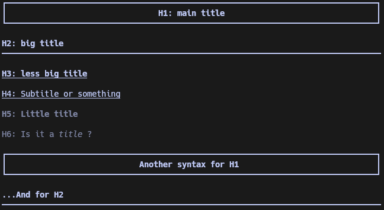

<details>
  <summary>Unfold to see sample</summary>
  
  ```markdown
  # H1: main title
  ## H2: big title
  ### H3: less big title
  #### H4: Subtitle or something
  ##### H5: Little       title
  ###### H6: Is it a *title* ?

  Another syntax for H1
  =====================

  ...And for H2
  ---
  ```

  Result:

  
</details>

