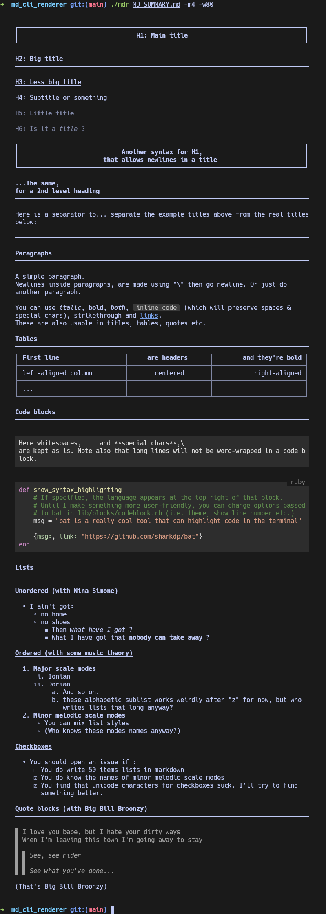

# MD CLI Renderer

It's a ruby script that aims to render markdown files in a close-to-github and nice way, directly in the terminal.

I initially started to write it for [nuts](https://github.com/ocgg/nuts), a simple bash script to manage note-taking in markdown using `fzf`. Then I kept doing this in a separate repo, just to see if I could.

## Prerequisites

- ruby (only tested >= 3.3.4, should work down to 3.0)
- `tty-table` gem for table rendering
- `bat` for code blocks rendering
- Any modern terminal (tested on Kitty, Alacritty, gnome-terminal, ...) for RGB colors & link support

```bash
# With ruby installed
gem install tty-table

# Have bat installed with you OS package manager, i.e. :
sudo apt-get install bat # Ubuntu
sudo dnf install bat # Fedora
sudo pacman -S bat # Arch
# ...
```

## Usage

- Clone this repo
- Go to the clone directory
- Execute `./mdr PATH_TO_YOUR_MARKDOWN_FILE`

For more options like width, align, margin etc: see [Terminal-specific features](#terminal-specific-features) below or print help with `./mdr --help`.

## Examples

The raw markdown file used for the example is here: [MD_SUMMARY.md](./MD_SUMMARY.md).

<details>
  <summary>See result</summary>

  In the example below, the terminal is Kitty with Hack Nerd font.  

  
</details>

## Markdown features

This app (the name's still to be found) aims to render markdown the same way as GitHub would.\
"*The same way*" here means "*the closest vs cleanest possible way*", as the terminal is indeed not a browser.

Here is a list of supported markdown features. To see terminal-specific features, see below.

As for now, it **fully supports** (I think):

- [X] Titles/headings
- [X] Paragraphs
- [X] Unordered/checkbox/mixed lists
- [X] Italic/bold/stroke text
- [X] Code blocks & inline code
- [X] Code syntax highlighting (through `bat`)
- [X] Quotes
- [X] Separators/Horizontal lines

**Future full support**:

- [X] Newlines inside paragraphs/lists/quotes (currently only works with `\` before newline)
- [X] Ordered lists (nested lists have unexpected behavior when more than ~26-39 items - but who writes lists that long?)
- [X] Tables (can behave weirdly or cause errors: dependency to tty-table will be removed to handle that)
- [X] URL links (link references not supported yet)

**Will (sometimes partially) support**:

- [ ] Images (if terminal supports them, else display link, or even draw a box with link)
- [ ] Footnotes (won't provide a link but will display nicely)
- [ ] Jump-to-section (same)
- [ ] File links

**Don't know if it will ever be supported**:

- [ ] basic HTML (newlines, comments, strong, em, hr...)

## Terminal-specific features

```
Usage: mdr FILEPATH [options]

Options:
    -w, --width=COLS                 Max output width
    -a, --align=DIR                  Align output (use with --width)
                                     DIR can be left, right or center
    -t, --mtop=LINES                 Top margin (empty lines before output)
    -b, --mbottom=LINES              Bottom margin (empty lines after output)
    -l, --mleft=COLS                 Left margin
    -r, --mright=COLS                Right margin
    -m, --margin=NUMBER              Sets margin for the 4 sides with top & bottom divided by 2
                                     Side-specific margins have priority on this
    -c, --clear                      Clear screen before output
```
