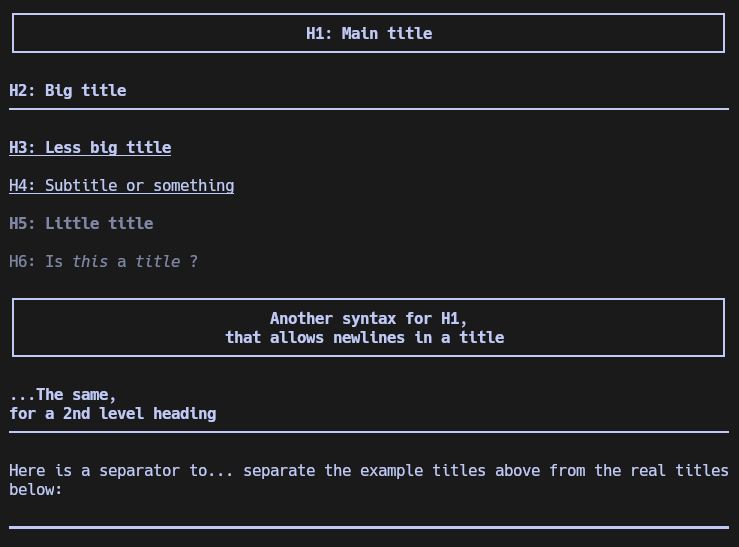
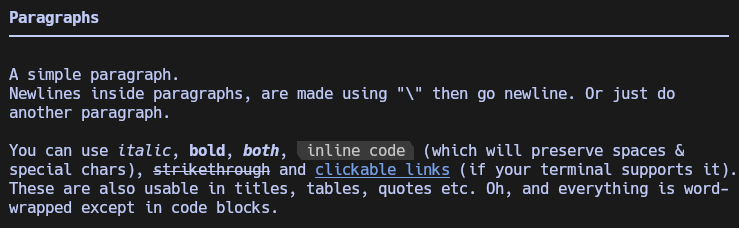
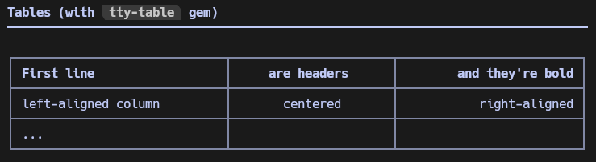
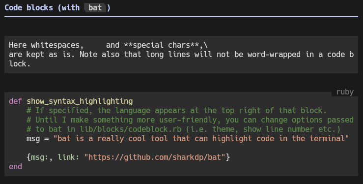
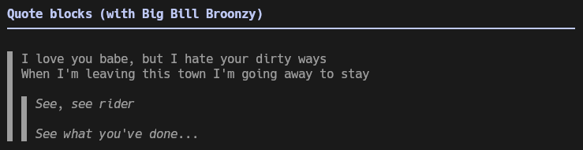

# MD CLI Renderer (mdr)

It's a ruby script that aims to render markdown files in the terminal, in a close-to-GitHub and nice way.

I initially started to write it for [nuts](https://github.com/ocgg/nuts), a simple bash script to manage markdown note-taking using [fzf](https://github.com/fuzzy-finder/fzf). Then I kept doing this in a separate repo, just to see if I could.

## Prerequisites

Have installed:

- Ruby (only tested >= 3.3.4, should work down to 3.0)
- [tty-table](https://github.com/piotrmurach/tty-table) gem for table rendering: `gem install tty-table`
- [bat](https://github.com/sharkdp/bat) for code blocks rendering (should be available with any Linux package manager, i.e. `sudo apt-get install bat` for Ubuntu)
- Any modern terminal (tested on Kitty, Alacritty, gnome-terminal, ...) for RGB colors & link support

## Usage

- Clone/download this repo
- Go to its directory
- Execute `./mdr PATH_TO_MARKDOWN_FILE`.

`./mdr --help` prints the command line arguments:

```
Usage: mdr MARKDOWN_FILE_PATH [options]

Options:
    -w, --width=COLS                 Max output width
    -a, --align=DIR                  Align output (use with --width)
                                     DIR can be left, right or center
    -t, --mtop=LINES                 Top margin (empty lines before output)
    -b, --mbottom=LINES              Bottom margin (empty lines after output)
    -l, --mleft=COLS                 Left margin
    -r, --mright=COLS                Right margin
    -m, --margin=NUMBER              Sets margin for the 4 sides. Top & bottom divided by 2
                                     Specific margins have priority on this
    -c, --clear                      Clear screen before output
```

## Examples

If you want to compare with raw markdown code or GitHub's style, the example's markdown file [is here](./MD_SUMMARY.md).

In the examples below, the terminal is [Kitty](https://github.com/kovidgoyal/kitty) with [Hack](https://github.com/source-foundry/Hack) font, and the max width is 80.

**Click to see**

<details>
  <summary>Titles & separator</summary>

  
</details>

<details>
  <summary>Paragraphs</summary>

  
</details>

<details>
  <summary>Tables</summary>

  
</details>

<details>
  <summary>Code blocks</summary>

  
</details>

<details>
  <summary>Quotes</summary>

  
</details>

## Objectives

`mdr` aims to render markdown the same way as GitHub would.\
"*The same way*" here means "*the closest vs cleanest possible way*".

- **Closest** from GitHub's behavior in markdown interpretation, following [this doc](https://docs.github.com/fr/get-started/writing-on-github/getting-started-with-writing-and-formatting-on-github/basic-writing-and-formatting-syntax),
- **vs Cleanest** because the terminal is not a web browser.

Here is a list of currently supported markdown features.

As for now, mdr **fully supports** (I think):

- [X] Titles/headings
- [X] Paragraphs
- [X] Unordered/checkbox/mixed lists
- [X] Italic/bold/stroke text
- [X] Code blocks & inline code
- [X] Code syntax highlighting (through [bat](https://github.com/sharkdp/bat))
- [X] Quotes
- [X] Separators/Horizontal lines

**Future full support**:

- [X] Newlines inside paragraphs/lists/quotes (currently only works with `\` before newline)
- [X] Ordered lists (indentation not like GH for now, and nested lists have unexpected behavior when more than ~26-39 items - but who writes lists that long?)
- [X] Tables (can behave weirdly or cause errors: dependency to tty-table will be removed to handle that)
- [X] URL links (link references not supported yet)

**Will, or will partially, support**:

- [ ] Images (if terminal supports them, else display link, or even draw a box with link)
- [ ] Footnotes (won't provide a link but will display nicely)
- [ ] Jump-to-section (same)
- [ ] Links to local files
- [ ] Render markdown from URL

**Don't know if it will ever be supported**:

- [ ] basic HTML (newlines, comments, strong, em, hr...)
- [ ] Blazing fast performance (I'd be surprised but I'll work on this)\
      Currently process any file <3000 chars long in ~200ms with a middle/low-end CPU
